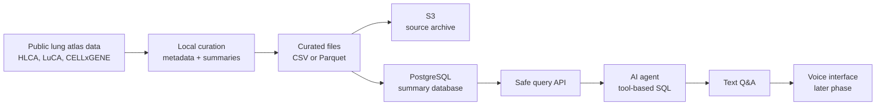
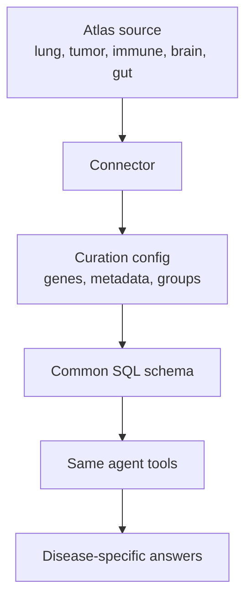

# OncoOmics Agent: NSCLC Atlas Edition

An advanced Bioinformatics Field Guide project: curate public single-cell lung cancer atlas data into a small AWS-hosted SQL database, then build an AI agent that can answer biological questions about non-small cell lung cancer (NSCLC) cell states, tumor microenvironment biology, and gene expression patterns.

## Who This Is For

This repo is for readers who want to:

- learn NSCLC tumor microenvironment biology through public single-cell data
- build a similar atlas-backed AI database agent
- practice SQL, AWS, and data curation with a real biomedical use case
- see how to keep AI-generated scientific answers grounded in queryable evidence

The writing aims to be direct, reproducible, and easy to navigate.

## Why This Project?

Public single-cell atlases have changed what a bioinformatics project can do. Instead of looking only at bulk tumor averages, we can ask questions at the level of cell types, tissue compartments, disease states, and patient-derived samples.

NSCLC is a strong disease focus because lung cancer progression involves tumor evolution, immune escape, stromal remodeling, metastasis, and treatment resistance. Those processes are not visible from one table or one omics layer alone. They require connecting:

- cell type annotations
- tumor versus non-tumor compartments
- gene expression
- sample and patient metadata
- public atlas provenance
- biological themes from studies such as TRACERx and PEACE

This project makes those connections queryable.

The scientific motivation is supported by three lines of evidence:

- The Human Lung Cell Atlas integrates large-scale lung single-cell data and provides reference cell type context for healthy and diseased lung tissue.
- LuCA focuses on NSCLC and supports cell-type-level exploration of tumor and immune microenvironment programs.
- TRACERx/PEACE studies show why lung cancer evolution, metastasis, and sampling context matter, even though controlled-access TRACERx data is not the first ingestion target.

## What It Solves

Researchers and learners often know the biological question but not the data engineering path:

> "Which NSCLC cell types express PD-L1?"

> "Are EMT genes more prominent in malignant epithelial cells or stromal compartments?"

> "Which immune checkpoint genes are enriched in exhausted T cells?"

> "What public dataset did this answer come from?"

The agent translates questions like these into safe SQL over curated public data, then returns an evidence-backed answer with the query, source tables, and caveats.

## What It Accomplishes

This repo is designed to demonstrate four skill sets in one coherent project:

- **Bioinformatics curation:** choose public atlas data, extract metadata, summarize expression, and preserve provenance.
- **SQL/database design:** model samples, cell types, genes, expression summaries, and source files in PostgreSQL.
- **AWS architecture:** deploy a small, budget-protected database and API using free-tier-friendly services.
- **AI agent engineering:** build a tool-using agent that answers from the database instead of guessing.

## Data Strategy

The project does **not** store millions of raw single-cell count profiles in PostgreSQL. That would be expensive, slow, and unnecessary for the first version.

Instead, v1 stores curated summary tables:

- gene expression by cell type
- expression by disease or sample group
- cell-type abundance summaries
- metadata for datasets, samples, and annotations
- source provenance

Recommended public sources:

- [Human Lung Cell Atlas / HLCA](https://data.humancellatlas.org/hca-bio-networks/lung/atlases/lung-v1-0) as the healthy/disease lung reference atlas.
- [LuCA single-cell Lung Cancer Atlas](https://github.com/icbi-lab/luca) as the NSCLC-focused tumor atlas.
- [CZ CELLxGENE LuCA collection](https://cellxgene.cziscience.com/collections/edb893ee-4066-4128-9aec-5eb2b03f8287) for atlas exploration and access.
- [TRACERx/PEACE NSCLC studies](https://www.nature.com/articles/s41586-023-05729-x) as biological framing for tumor evolution and metastasis. These are not the first ingestion target because some data are controlled-access or academic-use restricted.

## Big-Picture Architecture



## Biological Question For V1

> In NSCLC, how do tumor evolution, immune evasion, and microenvironment-associated genes vary across malignant epithelial cells, immune cells, stromal cells, and lung reference cell types?

Example v1 questions:

- Which cell types show the highest expression of `CD274` / PD-L1?
- Where are immune checkpoint genes such as `PDCD1`, `CTLA4`, `LAG3`, and `TIGIT` expressed?
- Which malignant or stromal cell types express EMT genes such as `VIM`, `ZEB1`, `SNAI1`, or `MMP9`?
- How does `EGFR`, `KRAS`, or `MET` expression vary by cell type?
- Which data source and SQL query produced the answer?

## Generalization And Customization

The project is intentionally built as a pattern, not a one-off NSCLC demo.

To customize it for another disease or atlas, swap the connector and curation config:



Possible future editions:

- COPD or pulmonary fibrosis atlas agent
- breast cancer tumor microenvironment atlas
- immune checkpoint atlas across tumor types
- pediatric tumor single-cell atlas
- private institutional atlas assistant

See [Customization Guide](docs/customization-guide.md).

## Primers

- [Biology Primer](docs/biology-primer.md)
- [Data Sources](docs/data-sources.md)
- [Database Primer](docs/database-primer.md)
- [AWS Primer](docs/aws-primer.md)
- [AWS Account Prep](docs/aws-account-prep.md)
- [AWS Implementation Plan](docs/aws-implementation-plan.md)
- [Execution Plan](docs/execution-plan.md)
- [Customization Guide](docs/customization-guide.md)
- [Scientific References](docs/scientific-references.md)

## AWS Cost-Conscious Plan

Use AWS only where it teaches the right skill:

- S3 for curated data files and exports
- RDS PostgreSQL or Aurora PostgreSQL for small summary tables
- Lambda or a tiny API service for read-only query endpoints
- IAM least-privilege credentials
- AWS Budgets before any deploy

Avoid expensive services in v1: Redshift, OpenSearch, large EC2 instances, raw single-cell matrix storage in RDS, and always-on heavy ETL.

## AWS Credentials Needed

To build the AWS portion, the local machine needs AWS CLI access to your account. I do **not** need secret keys pasted into chat or committed to the repo.

Minimum setup:

```bash
aws configure
aws sts get-caller-identity
```

The IAM identity should be allowed to create and manage:

- S3 buckets/objects
- RDS or Aurora PostgreSQL resources
- IAM roles/policies for the project
- Lambda/API Gateway if we use serverless
- CloudWatch logs
- AWS Budgets or billing alerts

Recommended project defaults:

- Region: `us-east-1`
- Monthly budget alert: `$5`
- Resource tag: `project=oncoomics-agent`
- Database content: public, processed, non-controlled data only
