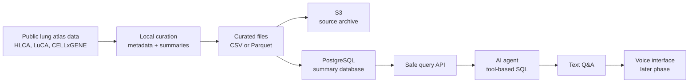
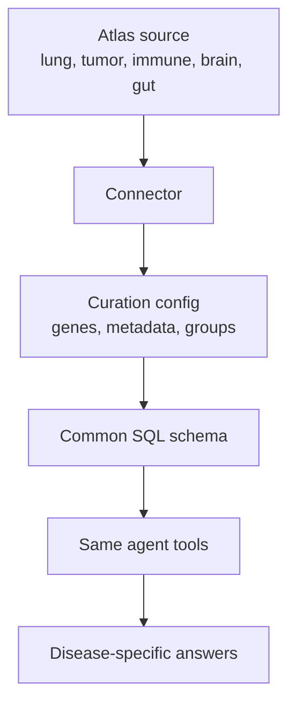

# OncoOmics Agent: NSCLC Atlas Edition

An advanced Bioinformatics Field Guide project: curate public [NSCLC](docs/biology-primer.md#why-nsclc) molecular and [single-cell atlas](docs/biology-primer.md#why-single-cell-data) resources into a compact [SQL database](docs/database-primer.md), then expose the evidence through a reproducible query layer and an interactive [Shiny results app](https://caffeinated-code.shinyapps.io/oncoomics-agent-nsclc-atlas/).

Repository display name: `OncoOmics_Agent_NSCLC_Atlas`.

The scientific focus is [lung adenocarcinoma and lung squamous cell carcinoma](docs/data-sources.md#implemented-v1-sources), [immune checkpoint](docs/biology-primer.md#v1-gene-themes) biology, [tumor microenvironment](docs/biology-primer.md#the-biological-setting) context, and the engineering pattern needed to turn public oncology data into a searchable atlas product.

## Expert Framing

This repo is built for a technical reader who wants to evaluate both the biology and the implementation. The current build combines public [TCGA PanCancer LUAD/LUSC](docs/data-sources.md#implemented-v1-sources) summaries from [cBioPortal](docs/scientific-references.md#core-dataset-references), [**LuCA**](docs/data-sources.md#primary-source-luca) metadata and cell-type evidence, and a schema that can later move from local SQLite to [AWS-hosted PostgreSQL](docs/aws-primer.md).

The project intentionally separates evidence levels:

- [mutation frequency](docs/biology-primer.md#v1-gene-themes), [RNA expression z-score](docs/biology-primer.md#why-single-cell-data), and [copy-number](docs/database-primer.md) summaries are quantitative TCGA-derived layers
- [LuCA](docs/data-sources.md#primary-source-luca) cell-type evidence is curated and clearly marked until matrix-derived single-cell expression is added
- [HLCA](docs/data-sources.md#reference-source-human-lung-cell-atlas) is recorded as the normal-lung reference layer for the next comparison module

## Who This Is For

This repo is for readers who want to:

- learn [NSCLC](docs/biology-primer.md#why-nsclc) [tumor microenvironment](docs/biology-primer.md#the-biological-setting) biology through public molecular and single-cell data
- learn the difference between [LUAD and LUSC](docs/biology-primer.md#luad-versus-lusc) before interpreting NSCLC plots
- build a similar atlas-backed database agent
- practice [SQL](docs/database-primer.md), [AWS](docs/aws-primer.md), [FAIR data practices](docs/fair-data-practices.md), and data curation with a real biomedical use case
- see how to keep scientific answers grounded in queryable evidence

The writing aims to be direct, reproducible, and easy to navigate.

## Why This Project?

Public [single-cell atlases](docs/biology-primer.md#why-single-cell-data) have changed what a bioinformatics project can do. Instead of looking only at bulk tumor averages, we can ask questions at the level of [cell types](docs/biology-primer.md#the-biological-setting), tissue compartments, disease states, and patient-derived samples.

[NSCLC](docs/biology-primer.md#why-nsclc) is a strong disease focus because lung cancer progression involves [tumor evolution](docs/data-sources.md#biological-framing-tracerx-and-peace), immune escape, stromal remodeling, metastasis, and treatment resistance. Those processes are not visible from one table or one omics layer alone. They require connecting:

- cell type annotations
- tumor versus non-tumor compartments
- gene expression
- sample and patient metadata
- public atlas provenance
- biological themes from studies such as [TRACERx and PEACE](docs/data-sources.md#biological-framing-tracerx-and-peace)

This project makes those connections queryable.

The scientific motivation is supported by three lines of evidence:

- The [Human Lung Cell Atlas](docs/data-sources.md#reference-source-human-lung-cell-atlas) integrates large-scale lung single-cell data and provides reference cell type context for healthy and diseased lung tissue.
- [**LuCA**](docs/data-sources.md#primary-source-luca) focuses on [NSCLC](docs/biology-primer.md#why-nsclc) and supports cell-type-level exploration of tumor and immune microenvironment programs.
- [**TRACERx/PEACE**](docs/data-sources.md#biological-framing-tracerx-and-peace) studies show why lung cancer evolution, metastasis, and sampling context matter, even though controlled-access TRACERx data is not the first ingestion target.

## What It Solves

Researchers and learners often know the biological question but not the data engineering path:

> "Which NSCLC cell types express PD-L1?"

> "Are EMT genes more prominent in malignant epithelial cells or stromal compartments?"

> "Which immune checkpoint genes are enriched in exhausted T cells?"

> "What public dataset did this answer come from?"

The agent translates questions like these into [safe SQL](docs/database-primer.md#query-safety-rules) over curated public data, then returns an evidence-backed answer with the query, source tables, and caveats.

## What It Accomplishes

This repo is designed to demonstrate four skill sets in one coherent project:

- **Bioinformatics curation:** choose public atlas data, extract metadata, summarize expression, and preserve provenance.
- **SQL/database design:** model samples, cell types, genes, expression summaries, and source files in [PostgreSQL](docs/database-primer.md).
- **AWS architecture:** deploy a small, budget-protected database and API using [free-tier-friendly services](docs/aws-primer.md).
- **Agent engineering:** build a tool-using query layer that answers from the database instead of guessing.

## Data Strategy

The project does **not** store millions of raw single-cell count profiles in PostgreSQL. That would be expensive, slow, and unnecessary for the first version.

Instead, v1 stores curated summary tables:

- gene expression by cell type
- expression by disease or sample group
- cell-type abundance summaries
- metadata for datasets, samples, and annotations
- source provenance

Recommended public sources:

- [TCGA PanCancer LUAD/LUSC via cBioPortal](docs/data-sources.md#implemented-v1-sources) for mutation, RNA expression, and copy-number summaries.
- [**LuCA single-cell Lung Cancer Atlas**](docs/data-sources.md#primary-source-luca) as the NSCLC-focused tumor atlas.
- [Human Lung Cell Atlas / HLCA](docs/data-sources.md#reference-source-human-lung-cell-atlas) as the healthy/disease lung reference atlas.
- [CZ CELLxGENE LuCA collection](https://cellxgene.cziscience.com/collections/edb893ee-4066-4128-9aec-5eb2b03f8287) for atlas exploration and access.
- [**TRACERx/PEACE NSCLC studies**](docs/data-sources.md#biological-framing-tracerx-and-peace) as biological framing for tumor evolution and metastasis. These are not the first ingestion target because some data are controlled-access or academic-use restricted.

## Big-Picture Architecture


```mermaid
flowchart LR
    A["Public lung atlas data<br/>HLCA, LuCA, CELLxGENE"] --> B["Local curation<br/>metadata + summaries"]
    B --> C["Curated files<br/>CSV or Parquet"]
    C --> D["S3<br/>source archive"]
    C --> E["PostgreSQL<br/>summary database"]
    E --> F["Safe query API"]
    F --> G["AI agent<br/>tool-based SQL"]
    G --> H["Text Q&A"]
    H --> I["Voice interface<br/>later phase"]
```

## Current Working Build

The repo now has a runnable local v1:

- curated public [TCGA LUAD/LUSC](docs/data-sources.md#implemented-v1-sources) molecular summaries from [cBioPortal](docs/scientific-references.md#core-dataset-references)
- a 30-gene [NSCLC](docs/biology-primer.md#why-nsclc) panel spanning driver, immune checkpoint, [EMT](docs/biology-primer.md#v1-gene-themes), myeloid, proliferation, hypoxia, antigen-presentation, and interferon biology
- compact CSV tables under `data/curated/`
- a normalized SQL schema under `sql/schema.sql`
- a local SQLite database for development
- a safe query CLI that maps biological questions to read-only SQL
- a generated NSCLC atlas report with SVG figures
- public [LuCA](docs/data-sources.md#primary-source-luca) metadata and cell-type evidence tables
- a Shiny results app for interactive review of mutation, expression, copy-number, and LuCA cell-context results

Run the full local build:

```bash
bash scripts/run_project_modules.sh all
```

Run modules separately:

```bash
bash scripts/run_project_modules.sh curate
bash scripts/run_project_modules.sh database
bash scripts/run_project_modules.sh report
bash scripts/run_project_modules.sh appdata
bash scripts/run_project_modules.sh query
bash scripts/run_project_modules.sh validate
```

Ask the local agent-style query layer:

```bash
python3 scripts/query_oncoomics_agent.py "Which driver genes are most frequently mutated in LUAD and LUSC?"
python3 scripts/query_oncoomics_agent.py "Which immune checkpoint genes are expressed?"
python3 scripts/query_oncoomics_agent.py "show source provenance"
```

Main report:

- [NSCLC Atlas Report](results/nsclc_atlas_report.md)
- [Action Report](results/oncoomics_nsclc_action_report.md)

Run the local Shiny app:

```r
shiny::runApp("shiny_app")
```

Public Shiny demo:

- [OncoOmics Agent NSCLC Atlas](https://caffeinated-code.shinyapps.io/oncoomics-agent-nsclc-atlas/)

## Biological Question For V1

> In [NSCLC](docs/biology-primer.md#why-nsclc), how do [tumor evolution](docs/data-sources.md#biological-framing-tracerx-and-peace), immune evasion, and [microenvironment](docs/biology-primer.md#the-biological-setting)-associated genes vary across malignant epithelial cells, immune cells, stromal cells, and lung reference cell types?

Example v1 questions:

- Which cell types show the highest expression of `CD274` / PD-L1?
- Where are immune checkpoint genes such as `PDCD1`, `CTLA4`, `LAG3`, and `TIGIT` expressed?
- Which malignant or stromal cell types express EMT genes such as `VIM`, `ZEB1`, `SNAI1`, or `MMP9`?
- How does `EGFR`, `KRAS`, or `MET` expression vary by cell type?
- Which data source and SQL query produced the answer?

## Generalization And Customization

The project is intentionally built as a pattern, not a one-off NSCLC demo.

To customize it for another disease or atlas, swap the connector and curation config:


```mermaid
flowchart TB
    A["Atlas source<br/>lung, tumor, immune, brain, gut"] --> B["Connector"]
    B --> C["Curation config<br/>genes, metadata, groups"]
    C --> D["Common SQL schema"]
    D --> E["Same agent tools"]
    E --> F["Disease-specific answers"]
```

Possible future editions:

- COPD or pulmonary fibrosis atlas agent
- breast cancer tumor microenvironment atlas
- immune checkpoint atlas across tumor types
- pediatric tumor single-cell atlas
- private institutional atlas assistant

See [Customization Guide](docs/customization-guide.md).

## Primers

- [Biology Primer](docs/biology-primer.md): [NSCLC](docs/biology-primer.md#why-nsclc), [single-cell data](docs/biology-primer.md#why-single-cell-data), [tumor microenvironment](docs/biology-primer.md#the-biological-setting), and [gene themes](docs/biology-primer.md#v1-gene-themes)
- [Data Sources](docs/data-sources.md): [LuCA](docs/data-sources.md#primary-source-luca), [HLCA](docs/data-sources.md#reference-source-human-lung-cell-atlas), [TRACERx/PEACE](docs/data-sources.md#biological-framing-tracerx-and-peace), and [implemented TCGA sources](docs/data-sources.md#implemented-v1-sources)
- [Database Primer](docs/database-primer.md): schema design, SQL safety, and evidence provenance
- [FAIR Data Practices](docs/fair-data-practices.md): how the repo keeps data findable, accessible, interoperable, and reusable
- [Project Roadmap](docs/roadmap.md): the next build sequence for LuCA matrix summaries, API, AWS, voice/chat, expert modules, and teaching assets
- [Implementation Status](docs/implementation-status.md)
- [AWS Primer](docs/aws-primer.md)
- [AWS Account Prep](docs/aws-account-prep.md)
- [AWS Implementation Plan](docs/aws-implementation-plan.md)
- [Execution Plan](docs/execution-plan.md)
- [Customization Guide](docs/customization-guide.md)
- [Scientific References](docs/scientific-references.md)

## AWS Cost-Conscious Plan

Use AWS only where it teaches the right skill:

- S3 for curated data files and exports
- RDS PostgreSQL or Aurora PostgreSQL for small summary tables
- Lambda or a tiny API service for read-only query endpoints
- IAM least-privilege credentials
- AWS Budgets before any deploy

Avoid expensive services in v1: Redshift, OpenSearch, large EC2 instances, raw single-cell matrix storage in RDS, and always-on heavy ETL.

## AWS Credentials Needed

To build the AWS portion, the local machine needs AWS CLI access to your account. I do **not** need secret keys pasted into chat or committed to the repo.

Minimum setup:

```bash
aws configure
aws sts get-caller-identity
```

The IAM identity should be allowed to create and manage:

- S3 buckets/objects
- RDS or Aurora PostgreSQL resources
- IAM roles/policies for the project
- Lambda/API Gateway if we use serverless
- CloudWatch logs
- AWS Budgets or billing alerts

Recommended project defaults:

- Region: `us-east-1`
- Monthly budget alert: `$5`
- Resource tag: `project=oncoomics-agent`
- Database content: public, processed, non-controlled data only
