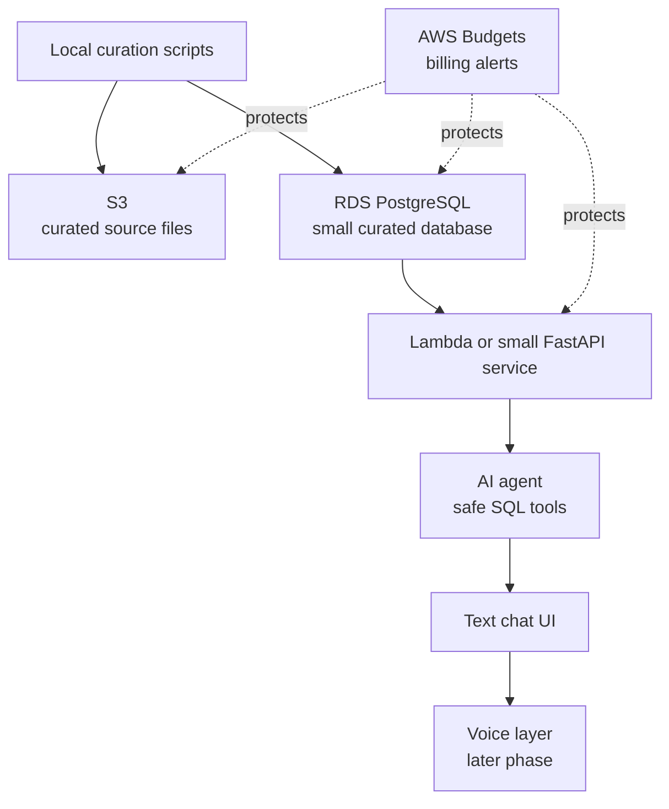

# AWS Primer: Cost-Conscious Bioinformatics Infrastructure

## Why AWS For This Project?

AWS lets this project demonstrate cloud engineering without building a giant production system. The goal is to show that a bioinformatics database can be curated, hosted, queried, and exposed to an AI agent using practical cloud components.

## Free-Tier Reality Check

AWS Free Tier terms changed for newer accounts. AWS currently describes a free plan and credit-based model for new customers, including up to $200 in credits depending on account setup and exploration steps. Some older accounts may still have legacy 12-month offers. Always confirm the active account's Free Tier page and billing dashboard before creating resources.

Helpful AWS pages:

- [AWS Free Tier](https://aws.amazon.com/free/)
- [AWS Free Tier FAQs](https://aws.amazon.com/free/free-tier-faqs/)
- [Amazon RDS Free Tier](https://aws.amazon.com/rds/free/)
- [AWS Lambda Pricing](https://aws.amazon.com/lambda/pricing/)
- [Amazon S3 Pricing](https://aws.amazon.com/s3/pricing/)

## Recommended Architecture

## Services To Use First

- S3 for curated source CSV or Parquet files.
- RDS PostgreSQL for the relational database.
- Lambda or a tiny container service for query APIs.
- IAM for least-privilege access.
- AWS Budgets and billing alerts before deploying anything.

## Services To Avoid In V1

- Redshift
- OpenSearch
- always-on GPU instances
- large Bedrock workloads
- raw FASTQ, BAM, or mass spectrometry file storage
- large ETL clusters

Those services may be useful later, but they are not needed for the first free-tier-conscious version.

## Cost Control Rules

- Keep the curated database under a few GB.
- Use processed public data, not raw omics files.
- Run one small database instance only when needed.
- Use row limits on all API queries.
- Create a budget alert at a very low threshold.
- Tag all resources with `project=oncoomics-agent`.
- Shut down or snapshot resources after demos if costs appear.

