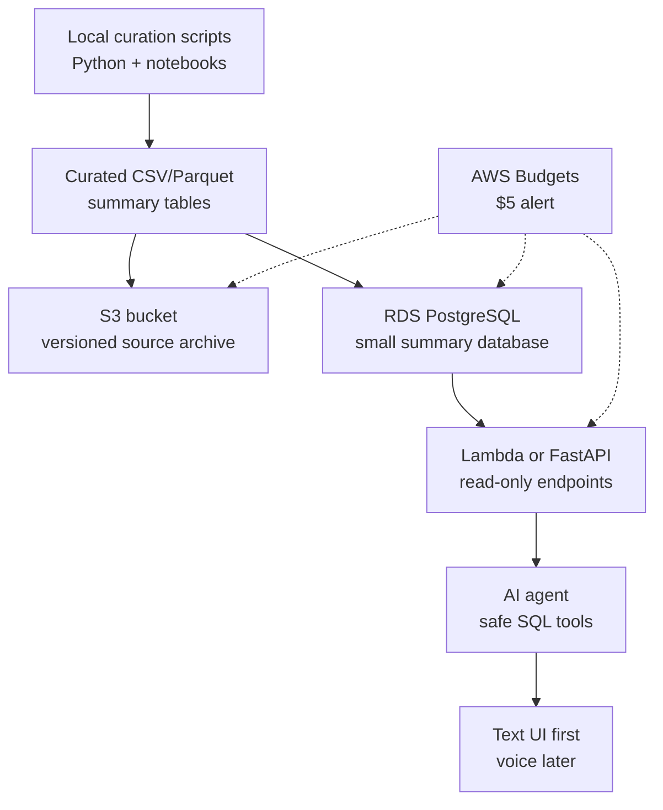

# AWS Primer: Free-Tier-Friendly Atlas Infrastructure

## Goal

Use AWS to show practical cloud skills without building an expensive research warehouse.

The AWS version should host:

- curated public data files
- a small PostgreSQL summary database
- a read-only query API
- logs, budgets, and access controls

## Current Free-Tier Model

AWS now describes Free Tier for new customers as a credit-based model with up to $200 in credits, depending on sign-up and onboarding steps. AWS also documents free-plan access and always-free services with monthly usage limits. Confirm the account's exact plan in the AWS Billing console before creating resources.

Useful official pages:

- [AWS Free Tier](https://aws.amazon.com/free/)
- [AWS Free Tier FAQs](https://aws.amazon.com/free/free-tier-faqs/)
- [AWS Free Tier plans documentation](https://docs.aws.amazon.com/awsaccountbilling/latest/aboutv2/free-tier-plans.html)
- [Amazon RDS Free Tier](https://aws.amazon.com/rds/free/)
- [AWS Lambda Pricing](https://aws.amazon.com/lambda/pricing/)
- [Amazon S3 Pricing](https://aws.amazon.com/s3/pricing/)

## Recommended V1 Architecture

## Services To Use

- **S3:** curated files, exports, and source manifests.
- **RDS PostgreSQL or Aurora PostgreSQL:** small relational summary database.
- **Lambda:** lightweight query API if the app remains simple.
- **API Gateway:** public API entry point if using Lambda.
- **CloudWatch:** logs for API calls and failures.
- **IAM:** least-privilege roles and users.
- **AWS Budgets:** cost alarm before anything else.

## Services To Avoid In V1

- Redshift
- OpenSearch
- SageMaker endpoints
- large EC2 instances
- raw `.h5ad` matrix storage inside PostgreSQL
- always-on ETL clusters

These can be later extensions, but they are not needed to prove the project.

## Cost-Control Defaults

- Region: `us-east-1`
- Budget alert: `$5`
- Database: smallest free-plan-compatible PostgreSQL option available in the account
- Storage: summary tables only, not raw count matrices
- Tag every resource: `project=oncoomics-agent`
- Delete or stop nonessential resources after demos

## Implementation Groundwork

See [AWS Implementation Plan](aws-implementation-plan.md) for the current deployment order and CloudFormation templates.
