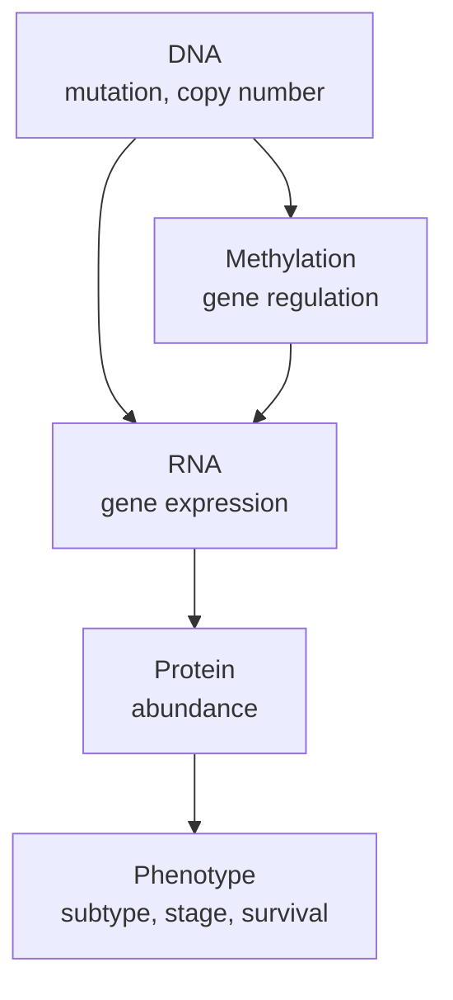

# Biology Primer: Why Cancer Multi-Omics?

## Why This Project Exists

Cancer biology is not explained by one data layer. A tumor may contain a DNA mutation, but the downstream effect may appear as altered RNA expression, changed protein abundance, pathway activation, clinical subtype, or survival difference. Public cancer datasets contain many of these layers, but they are spread across portals and often require technical expertise to combine.

This project builds a bridge between a biological question and the structured data needed to answer it.

## Core Biological Question

The first version focuses on:

> How do alterations in key cancer genes relate to RNA expression, protein abundance, copy number, and clinical context?

Example questions the agent should eventually answer:

- Which selected genes are most frequently altered in breast cancer?
- Do TP53-mutant tumors show different RNA expression than TP53-wildtype tumors?
- Is there protein-level evidence for a gene in the same or related cohort?
- Which samples have mutation, expression, and clinical data available?
- Which public sources contributed to this answer?

## Why Oncology?

Oncology is a strong starting point because:

- Cancer has mature public datasets.
- Many questions naturally require multi-omics reasoning.
- Results are relevant to academic, clinical, biotech, and pharma audiences.
- Public cancer resources have enough structure for SQL and API workflows.

Useful public resources include:

- [NCI Genomic Data Commons](https://gdc.cancer.gov/)
- [cBioPortal](https://www.cbioportal.org/)
- [NCI Proteomic Data Commons](https://proteomic.datacommons.cancer.gov/)
- [CPTAC](https://proteomics.cancer.gov/programs/cptac)

## What "Multi-Omics" Means Here

For the first build, "multi-omics" means integrating at least three of:

- mutation status
- copy number alteration
- RNA expression
- protein abundance
- clinical metadata

## Recommended Initial Scope

Start small and biologically coherent:

- Cancer type: breast cancer first
- Optional second cohort: ovarian cancer
- Genes: TP53, PIK3CA, BRCA1, BRCA2, ERBB2, PTEN, EGFR, KRAS, MYC, CDKN2A
- Data layers: mutation, copy number, RNA expression, protein abundance where available, clinical metadata

The goal is not to claim a new biological discovery in v1. The goal is to create a reliable research interface that can reproduce and explain database-backed observations.

