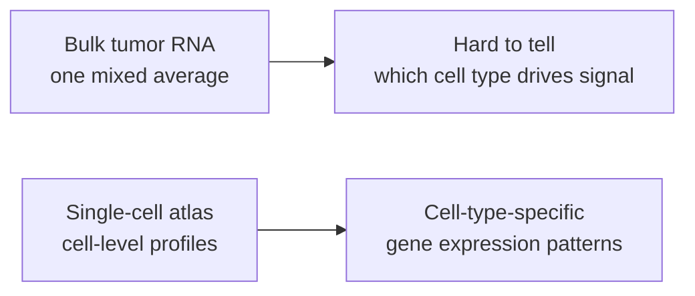
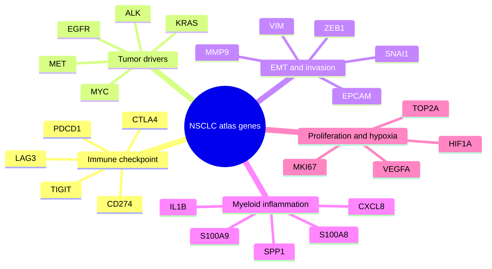

# Biology Primer: NSCLC, Cell Atlases, And The Tumor Microenvironment

## The Biological Setting

Non-small cell lung cancer (NSCLC) is not one uniform mass of tumor cells. A tumor sample can contain malignant epithelial cells, T cells, B cells, macrophages, neutrophils, fibroblasts, endothelial cells, airway epithelial cells, and other lung-resident populations.

Single-cell RNA sequencing helps separate those populations and ask:

- Which cells express a gene?
- Is expression tumor-cell-specific or microenvironment-driven?
- Which immune populations look activated, exhausted, suppressive, or inflammatory?
- Which stromal or epithelial programs may relate to invasion, metastasis, or resistance?

## Why Single-Cell Data?

Bulk RNA-seq averages expression across many cell types. That is useful, but it can hide the source of a signal.

For example, a high `CD274` / PD-L1 signal may come from malignant cells, macrophages, dendritic cells, or another compartment. A single-cell atlas lets us ask that directly.

## Why NSCLC?

NSCLC is a strong first disease focus because it connects multiple advanced biology themes:

- tumor evolution
- immune evasion
- epithelial plasticity
- stromal remodeling
- metastasis
- therapy resistance

TRACERx and PEACE studies provide the motivating biological story: lung cancer evolves across space and time, and metastasis is shaped by subclonal selection and tumor microenvironment context. This project uses that story to motivate public atlas questions, while keeping v1 data ingestion focused on easier-to-use public single-cell atlas resources.

## What Counts As Multi-Omics Here?

The first build is single-cell transcriptomics plus metadata. It is still an omics integration project because it connects expression with:

- cell type
- disease state
- sample metadata
- tumor or non-tumor compartment
- atlas provenance
- biological gene programs

Later versions can add mutation, copy number, spatial, proteomic, or clinical outcome tables where public access and licensing allow.

## V1 Gene Themes

## Example Questions

- Which NSCLC cell types express PD-L1 most strongly?
- Are exhaustion markers concentrated in T cells?
- Which myeloid populations express inflammatory genes?
- Do malignant epithelial cells show EMT-associated expression?
- Which results are from LuCA versus HLCA-derived sources?

