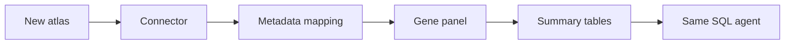

# Customization Guide

## Goal

The NSCLC edition should be a reusable pattern for other public atlas databases.

The reusable pieces are:

- curation workflow
- summary-table schema
- SQL query API
- AI agent tool contract
- AWS deployment pattern

## What Changes For A New Atlas?

For a new disease area, customize:

- source URLs
- license notes
- disease labels
- sample metadata fields
- cell type hierarchy
- gene panel
- benchmark biological questions

## Examples

### COPD Edition

- Source: lung disease atlas resources
- Focus: epithelial remodeling, inflammatory macrophages, airway cell states
- Gene panel: `MUC5AC`, `SCGB1A1`, `AGER`, `SFTPC`, `CXCL8`, `IL1B`

### Breast Cancer TME Edition

- Source: public breast cancer single-cell atlases
- Focus: tumor epithelial states, T cells, macrophages, fibroblasts
- Gene panel: `ERBB2`, `ESR1`, `PGR`, `EPCAM`, `VIM`, `CD274`, `PDCD1`

### Immune Checkpoint Edition

- Source: multiple tumor atlases
- Focus: checkpoint expression across tumor microenvironments
- Gene panel: `CD274`, `PDCD1`, `CTLA4`, `LAG3`, `TIGIT`, `HAVCR2`

## Stable Interface For The Agent

The agent should rely on a small set of stable tools:

- `get_schema`
- `search_genes`
- `summarize_gene_by_cell_type`
- `compare_gene_panel`
- `run_safe_sql`
- `get_source_provenance`

As long as a new atlas can populate the common summary tables, the same agent can answer questions over it.

