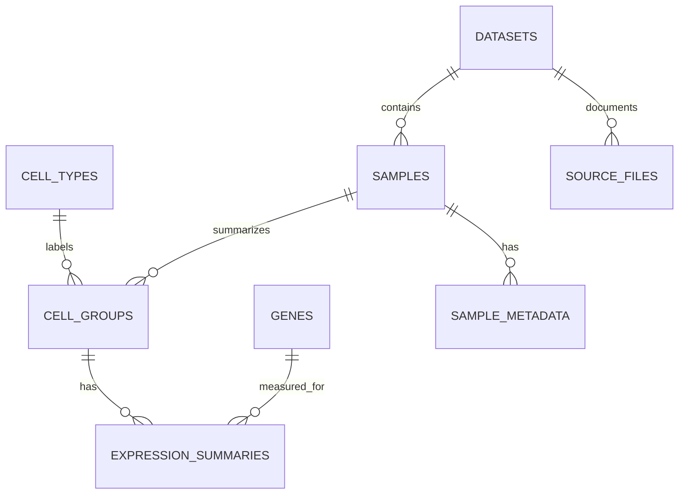

# Database Primer: SQL For A Single-Cell Atlas Agent

## Why SQL Instead Of A Raw Matrix?

Single-cell datasets can contain millions of cells and tens of thousands of genes. A full raw matrix is not a good first target for a small AWS PostgreSQL database.

For this project, PostgreSQL stores **curated summaries** that are easy to query and explain:

- average expression by gene and cell type
- percent of cells expressing each gene
- cell-type abundance by sample or disease group
- sample and dataset metadata
- source provenance

The raw or downloaded atlas files can live outside the database, usually in local storage or S3.

## Conceptual Schema



## Core Tables

- `datasets`: atlas or study-level source metadata
- `source_files`: downloaded file names, URLs, versions, licenses, and checksums
- `samples`: sample-level metadata such as disease, tissue, assay, and source
- `sample_metadata`: flexible key-value metadata for fields that vary across sources
- `cell_types`: harmonized cell type names and hierarchy
- `cell_groups`: sample-by-cell-type groups used for summary statistics
- `genes`: gene symbols and stable identifiers
- `expression_summaries`: mean expression, percent expressed, and cell counts
- `cell_type_abundance`: optional per-sample cell-type abundance summaries
- `query_logs`: optional agent query traces for evaluation

## Example Query

Question:

> Which cell types have the highest CD274 expression in NSCLC samples?

SQL shape:

```sql
SELECT
  ct.cell_type_name,
  AVG(es.mean_expression) AS avg_expression,
  AVG(es.percent_expressed) AS avg_percent_expressed,
  SUM(es.n_cells) AS total_cells
FROM expression_summaries es
JOIN genes g ON g.gene_id = es.gene_id
JOIN cell_groups cg ON cg.cell_group_id = es.cell_group_id
JOIN cell_types ct ON ct.cell_type_id = cg.cell_type_id
JOIN samples s ON s.sample_id = cg.sample_id
WHERE g.symbol = 'CD274'
  AND s.disease = 'non-small cell lung cancer'
GROUP BY ct.cell_type_name
HAVING SUM(es.n_cells) >= 50
ORDER BY avg_expression DESC
LIMIT 10;
```

## Why This Is Agent-Friendly

The schema has clear biological nouns:

- datasets
- samples
- cell types
- genes
- expression summaries

That makes it easier for an AI agent to map natural language to SQL safely.

## Guardrails

- Use read-only database credentials for the agent.
- Only allow `SELECT` queries from the agent.
- Add query timeouts and row limits.
- Keep unsupported questions honest: return "not available in this curated database" instead of guessing.
- Always return source provenance with scientific answers.

