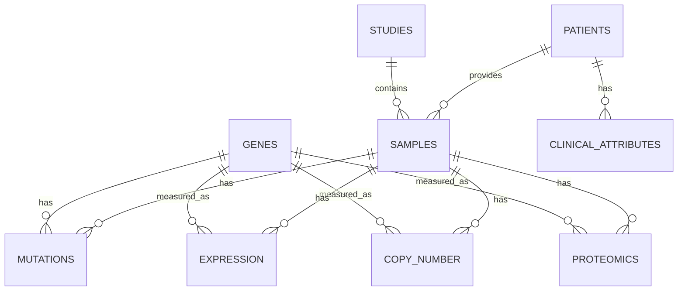

# Database Primer: Turning Public Omics Data Into SQL

## Why A Database?

Public omics data often arrives as files, API responses, matrix tables, and metadata records. A relational database gives the project a stable way to join samples, genes, assays, and clinical attributes.

The database should answer questions like:

> For TP53 in breast cancer, compare mutant and wildtype samples by RNA expression and protein abundance.

That requires joining:

- sample metadata
- gene identifiers
- mutation calls
- expression values
- protein values
- clinical annotations

## Conceptual Data Model



## Initial Tables

- `studies`: source study or cohort metadata
- `patients`: public patient or case identifiers
- `samples`: sample-level metadata and cancer type
- `genes`: approved gene symbols and identifiers
- `mutations`: selected gene mutation calls
- `expression`: selected gene RNA expression values
- `copy_number`: selected gene copy-number calls or values
- `proteomics`: selected gene protein abundance values where available
- `clinical_attributes`: flexible clinical annotations
- `source_files`: provenance for every imported file
- `query_logs`: optional record of agent queries for debugging and evaluation

## Why Not Load Everything?

The portfolio version should curate a focused slice. Large raw sequencing and proteomics files are expensive to store, slow to process, and unnecessary for demonstrating the core system.

Use processed public tables first:

- selected cancer types
- selected genes
- selected assay layers
- selected clinical fields

This keeps the database understandable and inexpensive.

## Example Query

```sql
SELECT
  s.cancer_type,
  g.symbol,
  CASE WHEN m.sample_id IS NULL THEN 'wildtype_or_no_selected_mutation'
       ELSE 'mutated'
  END AS mutation_group,
  AVG(e.expression_value) AS avg_rna_expression,
  AVG(p.protein_abundance) AS avg_protein_abundance,
  COUNT(DISTINCT s.sample_id) AS sample_count
FROM samples s
JOIN genes g ON g.symbol = 'TP53'
LEFT JOIN mutations m
  ON m.sample_id = s.sample_id
 AND m.gene_id = g.gene_id
LEFT JOIN expression e
  ON e.sample_id = s.sample_id
 AND e.gene_id = g.gene_id
LEFT JOIN proteomics p
  ON p.sample_id = s.sample_id
 AND p.gene_id = g.gene_id
WHERE s.cancer_type = 'Breast Invasive Carcinoma'
GROUP BY s.cancer_type, g.symbol, mutation_group;
```

## Database Design Principles

- Keep biological entities explicit: studies, patients, samples, genes.
- Keep omics measurements separate by assay type.
- Preserve source provenance for every row.
- Store only public, processed, non-controlled data in v1.
- Add row limits and read-only database credentials for the agent.

