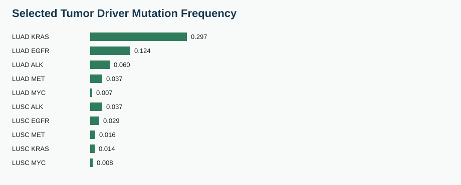
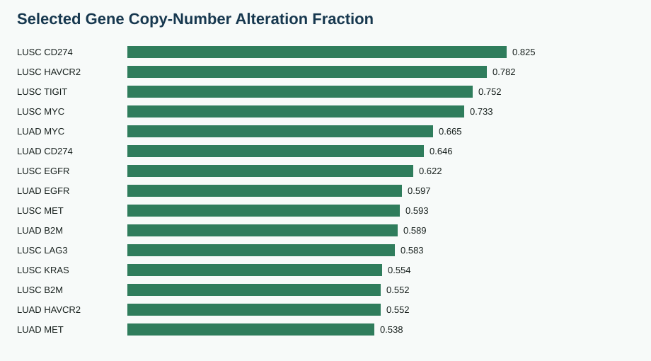

# OncoOmics Agent NSCLC Atlas Report

## Scope

This v1 report builds a compact public NSCLC database from cBioPortal TCGA PanCancer LUAD and LUSC studies, then records LuCA and HLCA as single-cell atlas sources for the next curation layer.

The database is intentionally summary-first. It stores gene-panel mutation, RNA expression z-score, and discrete copy-number summaries for fast SQL queries. Raw single-cell matrices remain outside the database.

## Database Contents

| table_name | rows |
| --- | --- |
| datasets | 4 |
| samples | 1053 |
| genes | 30 |
| expression_observations | 29820 |
| mutation_observations | 776 |
| cna_observations | 29940 |

## Driver Mutation Patterns

| cancer_type | symbol | label | mutated_samples | sequenced_samples | mutation_frequency |
| --- | --- | --- | --- | --- | --- |
| LUAD | KRAS | LUAD KRAS | 168 | 566 | 0.297 |
| LUAD | EGFR | LUAD EGFR | 70 | 566 | 0.124 |
| LUAD | ALK | LUAD ALK | 34 | 566 | 0.06 |
| LUAD | MET | LUAD MET | 21 | 566 | 0.037 |
| LUAD | MYC | LUAD MYC | 4 | 566 | 0.007 |
| LUSC | ALK | LUSC ALK | 18 | 487 | 0.037 |
| LUSC | EGFR | LUSC EGFR | 14 | 487 | 0.029 |
| LUSC | MET | LUSC MET | 8 | 487 | 0.016 |
| LUSC | KRAS | LUSC KRAS | 7 | 487 | 0.014 |
| LUSC | MYC | LUSC MYC | 4 | 487 | 0.008 |

LUAD shows the expected enrichment of `KRAS` and `EGFR` mutations in this selected panel. LUSC has lower frequencies for those LUAD-associated drivers, consistent with treating LUAD and LUSC as distinct biological contexts.

## Immune Checkpoint RNA Context

| cancer_type | symbol | n_samples | fraction_high_zscore |
| --- | --- | --- | --- |
| LUAD | LAG3 | 510 | 0.165 |
| LUAD | PDCD1 | 510 | 0.165 |
| LUAD | TIGIT | 510 | 0.159 |
| LUAD | CD274 | 510 | 0.155 |
| LUAD | CTLA4 | 510 | 0.153 |
| LUAD | HAVCR2 | 510 | 0.143 |
| LUSC | CD274 | 484 | 0.186 |
| LUSC | HAVCR2 | 484 | 0.167 |
| LUSC | PDCD1 | 484 | 0.163 |
| LUSC | CTLA4 | 484 | 0.157 |
| LUSC | TIGIT | 484 | 0.157 |
| LUSC | LAG3 | 484 | 0.153 |

These are bulk tumor RNA z-score summaries. They support cohort-level immune-context questions but cannot identify the exact cell type producing each transcript. LuCA single-cell summaries are the correct next layer for cell-source resolution.

## LuCA Cell-Type Context

| title | cell_count | h5ad_filesize_gb | disease_labels |
| --- | --- | --- | --- |
| The single-cell lung cancer atlas (LuCA) -- extended atlas | 1283972 | 17.617 | chronic obstructive pulmonary disease;lung adenocarcinoma;non-small cell lung carcinoma;normal;squamous cell lung carcinoma |
| The single-cell lung cancer atlas (LuCA) -- core atlas | 892296 | 12.897 | chronic obstructive pulmonary disease;lung adenocarcinoma;non-small cell lung carcinoma;normal;squamous cell lung carcinoma |

The LuCA collection is represented as public CELLxGENE metadata and a curated cell-type evidence layer in this v1 database. The H5AD assets are large, so quantitative matrix extraction is kept as the scalable next step.

| symbol | cell_type_name | compartment | expected_expression | quantitative_status |
| --- | --- | --- | --- | --- |
| CD274 | malignant cell | malignant tumor | context-dependent | not_matrix_quantified_in_v1 |
| CD274 | dendritic cell | myeloid immune | moderate | not_matrix_quantified_in_v1 |
| CD274 | macrophage | myeloid immune | moderate | not_matrix_quantified_in_v1 |
| CTLA4 | CD4-positive, alpha-beta T cell | lymphoid immune | moderate | not_matrix_quantified_in_v1 |
| CTLA4 | regulatory T cell | lymphoid immune | high | not_matrix_quantified_in_v1 |
| EGFR | epithelial cell of lung | epithelial | moderate | not_matrix_quantified_in_v1 |
| EGFR | malignant cell | malignant tumor | high | not_matrix_quantified_in_v1 |
| MKI67 | CD8-positive, alpha-beta T cell | lymphoid immune | context-dependent | not_matrix_quantified_in_v1 |
| MKI67 | malignant cell | malignant tumor | high | not_matrix_quantified_in_v1 |
| PDCD1 | CD4-positive, alpha-beta T cell | lymphoid immune | moderate | not_matrix_quantified_in_v1 |
| PDCD1 | CD8-positive, alpha-beta T cell | lymphoid immune | high | not_matrix_quantified_in_v1 |
| PDCD1 | regulatory T cell | lymphoid immune | moderate | not_matrix_quantified_in_v1 |
| S100A8 | classical monocyte | myeloid immune | high | not_matrix_quantified_in_v1 |
| S100A8 | neutrophil | myeloid immune | high | not_matrix_quantified_in_v1 |
| SPP1 | malignant cell | malignant tumor | context-dependent | not_matrix_quantified_in_v1 |
| SPP1 | macrophage | myeloid immune | high | not_matrix_quantified_in_v1 |
| VIM | malignant cell | malignant tumor | context-dependent | not_matrix_quantified_in_v1 |
| VIM | fibroblast of lung | stromal | high | not_matrix_quantified_in_v1 |
| VIM | stromal cell | stromal | high | not_matrix_quantified_in_v1 |

This table is designed for transparent agent behavior. It can answer compartment-level questions now while marking the quantitative status of each statement.

## Copy-Number Context

| label | altered_fraction |
| --- | --- |
| LUSC CD274 | 0.825 |
| LUSC HAVCR2 | 0.782 |
| LUSC TIGIT | 0.752 |
| LUSC MYC | 0.733 |
| LUAD MYC | 0.665 |
| LUAD CD274 | 0.646 |
| LUSC EGFR | 0.622 |
| LUAD EGFR | 0.597 |
| LUSC MET | 0.593 |
| LUAD B2M | 0.589 |
| LUSC LAG3 | 0.583 |
| LUSC KRAS | 0.554 |
| LUSC B2M | 0.552 |
| LUAD HAVCR2 | 0.552 |
| LUAD MET | 0.538 |

Discrete GISTIC values are useful screening features. They should be interpreted with mutation, expression, focality, purity, and histology context.

## Current Biological Interpretation

- The project now has a real SQL-backed NSCLC molecular context using public LUAD and LUSC data.
- The strongest v1 signal is disease-aware separation of LUAD and LUSC driver biology.
- Checkpoint and myeloid RNA summaries should be treated as tumor-level context until single-cell LuCA summaries are ingested.
- The LuCA evidence layer enables cell-compartment reasoning, with explicit status labels for matrix-derived versus curated evidence.
- Multi-omics in v1 means mutation, RNA expression, copy number, source provenance, and single-cell atlas source mapping.

## Next Data Layer

The next implementation step is to ingest LuCA-derived cell-type expression summaries for the same gene panel. That will allow the agent to answer which malignant, immune, or stromal cell compartments express each marker.